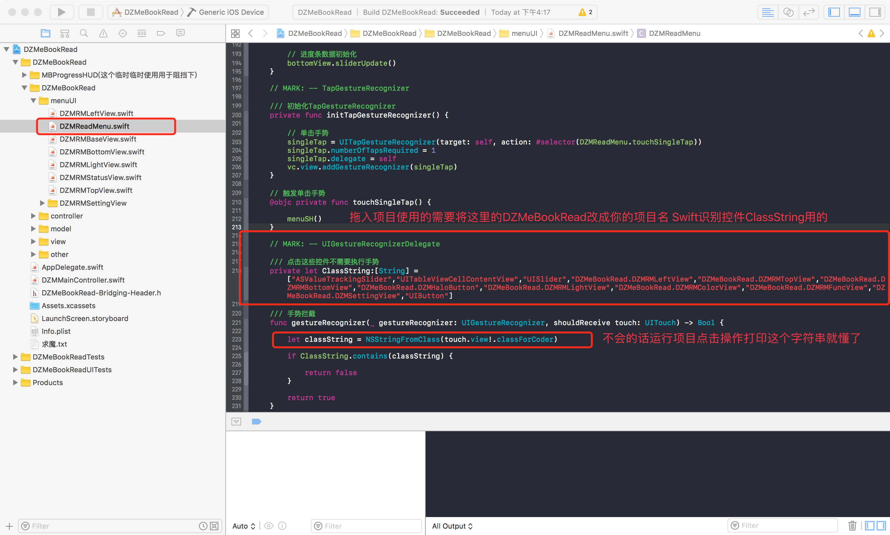
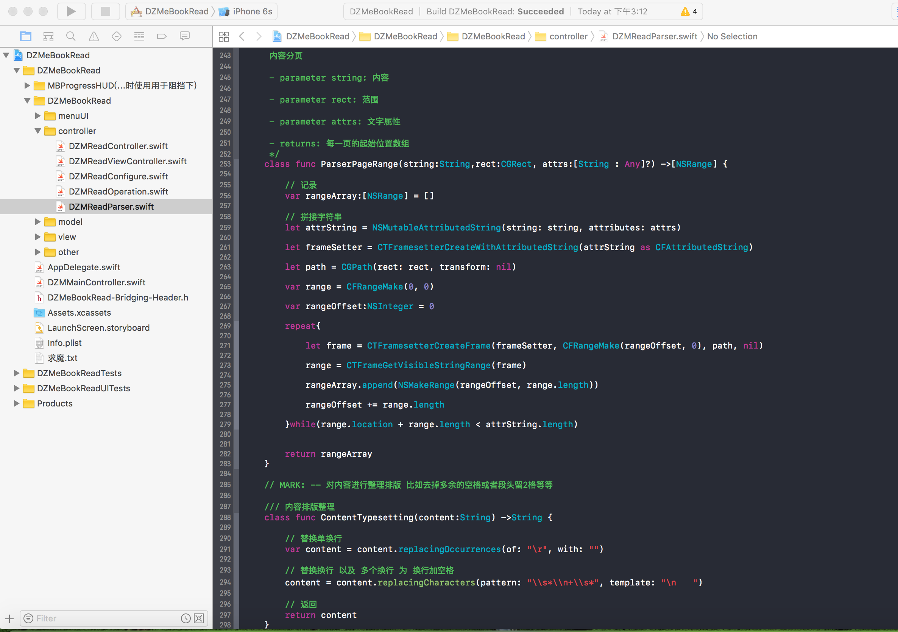
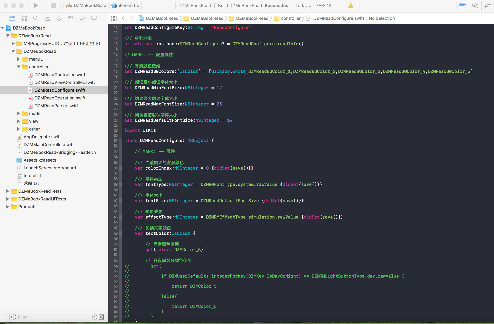
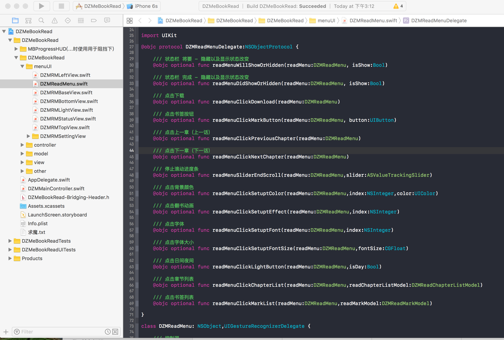

# DZMeBookRead

 
 


```diff
+ 鸟宿池边树，僧敲月下门
- 鸟宿池边树，僧推月下门
```

```diff
推荐下自己写的无限滚动：通常的都是传入URL数组进行无限滚动，而这个则是传入自定义的(Views)视图数组进行无限滚动，也支持控制器无限滚动，有兴趣的可以试试：https://github.com/dengzemiao/DZMCycleScrollView
```

***
#### 简介:

    iOS11适配完成- 有时间我会把下划线,笔记...这些常用功能加进去

    (不好意思 为了展示更多 下载包可能有点大 因为放了下面的展示图片)

    项目推到重做 代码简洁注释多 方法封装可拷贝 该项目支持直接拖入项目使用

    翻页效果: 无效果,覆盖,仿真,上下滚动

    其他功能: 字体切换 书签功能 阅读记录 亮度调整 背景切换 文件解析  内容排版美观优化(多余空格回车都会进行清理) 分页精确

    (网络小说获取章节地方有代码提示怎么做) 仿真模式翻页背面颜色跟着主颜色变(系统默认是白色)

    定位: 阅读记录 书签 定位精确

    内存: 只要看不见的章节都会进行清理内存 不会占用内存
    
***
#### 小说相关库：

    小说《覆盖效果》DZMCoverAnimation: https://github.com/dengzemiao/DZMCoverAnimation

    UIPageViewController 翻页背景颜色修改 : http://www.jianshu.com/p/3e75fa22ada8

***
#### Epub:
    用WebView来做 那需要JS功底而且效果还没那么好, 那么可以参考这个大神的思路把它解析成跟Txt一样的章节文件进行阅读:https://github.com/GGGHub/Reader, 可以只看他的Epub解析代码即可,获得章节字符串之后跟我的Demo一样都转成章节模型存起来 就都是一样了, 封面图片什么都是可以进行图文混排的。 你要是JS好的话可以忽略这句话

***
#### 唯一遗憾:
    上下滚动 出现新章节会稍有点卡顿 原因是 在刷新字体以及绘制UI 但是不影响使用以及阅读 如果谁有好的办法解决麻烦联系下我

#### 功能扩展 ( 本地阅读 快速进入 ):
    正则搜索获取小说所有的章节Range Range数组需要保存 然后在加载一或多个(自定)章节 立马回调进入阅读页面 其他章节在后台解析 然后在ReadModel中做个BOOL值判断是否解析完成这个小说(也可以使用记录解析到的章节ID是否有值来做判断) 也需要记录当前解析到什么章节 以防没有解析完成用户就退出APP 这样会终止导致不全 下次进入这本书可以继续后台进行解析。 当点击没有解析出来的章节时 可通过Range数组直接去获取出来 在后台解析章节的地方则需要判断是否存在该章节存在则不解析 当解析到最后一张了 则把ReadMode的BOOL值设为完成 然后情况不需要的数据(比如记录章节位置的 或者章节Rang数组什么的) 注意:显示的章节会先检查本地有没有存在可阅读文件的 我这里占时不做这个了 怕到时候代码太多乱

***
## 有BUG请联系我 技术QQ群:52181885 （入群需要回答问题：常用的网络请求框架? 有的QQ版本不显示问题 已经出现过这样的情况 所以入群自己填上答案就行 防止广告之类的人进入）

***
#### Demo效果GIF：


***
#### 文件介绍:




***
#### 部分代码浏览:






