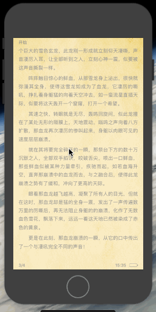
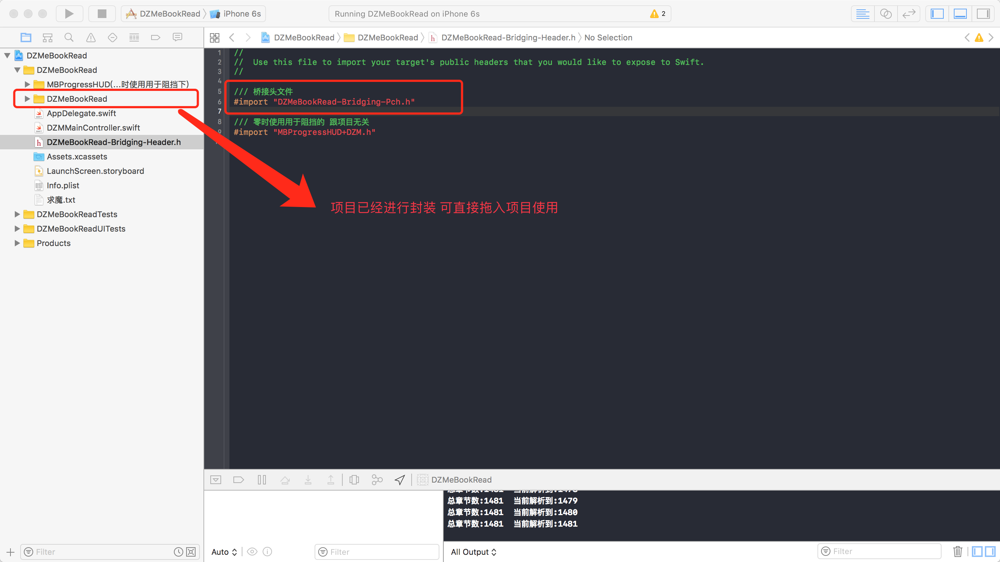

# DZMeBookRead


***
#### OC如何集成改Demo

OC集成Demo - https://github.com/dengzemiao/OCDZMeBookRead

***
#### Demo效果：


***
#### 阅读打开书籍效果(已封装,使用简单,下载地址在下面):



***

```diff
- 推荐下自己写的:

- -> 图片展示器:
- 支持横竖屏,屏幕旋转,使用简单,注释多可扩展程度高,兼容Swift混编使用
- 有兴趣的可以试试: https://github.com/dengzemiao/DZMPhotoBrowser
```
***
#### 项目思路理解:

    1. 将一个完整的TXT或者文本解析成一章一章的章节模型，通过归档的模式进行缓存起来(归档解析速度比数据库要快)。
    
    归档缓存方式:
    
        通过 bookID 和 chapterID 作为文件夹以及文件名进行缓存,
    
        这样做的话那么只需要面对 bookID 和 chapterID 就可以知道本地是否有这个章节存在以及获取阅读,
        
        同时在网络小说的情况下,你需要通过 bookID 和 chapterID 就在任何位置，或者后台进行缓存下载章节，并同时进行流畅阅读,
        
        只需要在阅读或者下载的时候判断下本地是否存在该章节归档文件就可以避免重复下载。
        
    2. 创建一个 readModel, readModel 里面存放的是这本小说的公用属性, 比如阅读记录, 书签, 等等...
    
       在阅读过程中就是起到一个针对这本小说需要公用属性以及记录属性的作用
       
       那么怎么使用它进入阅读呢？ 你只需要通过一个 bookID 获得一个 readModel 对象, 然后使用它里面修改阅读记录的方法, 
       
       将你需要阅读的章节的 chapterID 传进去修改为当前这个 readModel 的阅读记录对象即可, 你修改阅读记录的章节必须存在,
       
       也就是说你是网络小说就要先将要阅读的章节下载到本地归档好, 本地小说就先解析一章到本地归档好, 在使用 readModel 进行修改阅读记录,
       
       然后传给控制器就可以进行阅读了。
       
    3. readModel里面的 readChapterListModels 是可有可无的, 阅读过程中不依赖章节列表, 也就是说你可以先设置章节列表, 也可以删除不使用,
    
       也可以在 DZMRMLeftView 里面去单独请求这个章节列表的数据, 它的作用只是用于手动选章节的使用得到一个 chapterID 进行加载并缓存阅读而已,
       
       一般 chapterModel 里面就已经带好了当前章节ID以及上下章章节ID。
       
    4. 网络小说使用:
        
       1).进入阅读页的时候获取一个你要阅读的 chapterID, 这个 chapterID 的章节内容需要存在本地归档文件里面, 并通过 readModel 修改为阅读记录对象,就可以传入控制器进行阅读了。
       
       2).然后在上下翻页里面根据 chapterID 判断是否有归档文件, 没有就下周并缓存, 修改为阅读记录进行继续阅读, 如果不知道在哪里修改, 全局搜索 "网络小说操作提示", 可以看注释。
       
       3).边下载边看这个操作就可以看上面 1. 的提示了。
       
       4).章节归档处理的 增删改查 都已经封装, 可以直接使用 在 DZMGlobalMethod.swift 文件中下面。
       
***
#### 功能扩展 ( 本地阅读 快速进入 ):

    使用正则搜索出所有章节NSRange数组(本Demo就有)
    
    然后可解析一章(多少章自己觉定,也可以做到加载一页或几页)之后,直接跳转阅读页面
    
    剩余的章节则在一个异步线程中后台解析并存放到相同的路径(解析以及存储方法本Demo都有,只需找个地方进行异步解析)
    
    同时在解析过程中也要以防出现退出或者问题导致解析结束,那么则每解析一章都需要进行记录相关需要的数据(比如解析到第几章...)
    
    在异步解析过程中可能你同时也在阅读,你也可能在章节列表中随意选择一章,但是这一章还没解析到,那么你就要通过NSRange数组直接解析并存储并进入阅读
    
    在异步解析过程中每解析到一章你则需要判断存储文件里面是否已经有文件存在,也是避免上一步操作带来的重复解析的问题
    
    当解析完毕则需要设置一个BOOL值在进行记录这一本书解析完毕,一面下次在重复操作(本Demo则可以将BOOL值放入ReadModel中)
    
    (本Demo暂时没做这个快速进入功能,这个需要自己根据需求添加,不明白可进群咨询)

***
#### epub提示

    DTCoreText主要功能就是能够将我们输入的HTML文件进行解析,并自动关联相对应的css样式（也帮我们解析好了),我们需要做的就是输入一个HTML文件,
    
    他就会给我们输出带有排版样式的NSAttributedString，然后我们直接使用CoreText进行画这个NSAttributedString就可以啦！

    Github地址：https://github.com/Cocoanetics/DTCoreText

***
#### 简介:

    提示: 如需导入项目请看下面的的 - 导入项目流程
    
    2018-9-17 更新:
    
        优化代码, 添加标题大字体显示
    
    2018-4-24 更新:

        更新 Swift4.1 - Xcode9.3

    2018-1-26 更新:

        更新 Swift4.0 - Xcode9.2

    2017-12-21 更新:

        支持 PageViewController (仿真模式)翻页背面内容效果

    2017-12-14 更新:
    
        添加长按放大并选中文字进行拷贝

    2017-12-14 之前更新:

        iOS11 iPhoneX 适配完成 

        本Demo代码简洁注释多,方法封装可拷贝,该项目支持直接拖入项目使用

        翻页效果: 无效果,覆盖,仿真,上下滚动

        其他功能: 字体切换,书签功能,阅读记录,亮度调整,背景切换,文件解析,内容排版美观优化(多余空格回车都会进行清理),分页精确...

        背景: (网络小说获取章节地方有代码提示怎么做),仿真模式翻页背面颜色跟着主颜色变(系统默认是白色)

        定位: 阅读记录,书签,定位精确

        内存: 只要看不见的章节都会进行清理内存,不会占用内存
    
***
#### 小说相关库：

放大镜: https://github.com/dengzemiao/DZMMagnifierView

阅读打开书籍效果: https://github.com/dengzemiao/DZMAnimatedTransitioning

小说《覆盖效果》: https://github.com/dengzemiao/DZMCoverAnimation

UIPageViewController 翻页背景颜色修改: http://www.jianshu.com/p/3e75fa22ada8

***
#### 遗憾:

    1.上下滚动模式 飞速滑动时CPU会跟不上导致有些卡顿
    
    参考解决:
    
        1).可通过调整 tableView.decelerationRate 来进行控制。
        
        2).可看懂源码之后优化部分代码
        
    2.有时候每一页后面会少一个文字或者多个文字（后面我会找时间调整下这个区域的问题）
    
    原因: 是因为我展示内容的 readView 的 frame 我给的是固定的,这个我暂时还没有细调整。
    
    解决办法: 也就是说这个是 readiView 的展示区域或者字体大小不合理导致没法按着给与的大小区域排版造成的。

***
## 有BUG请联系我 技术QQ群:52181885 （入群需要回答问题：常用的网络请求框架? 有的QQ版本不显示问题 已经出现过这样的情况 所以入群自己填上答案就行 防止广告之类的人进入）

***
#### 导入项目流程:



***
#### Demo语言版本( 2018-9-6 停止更新)

Swift3.x - https://github.com/dengzemiao/DZMeBookRead-Swift3.x

